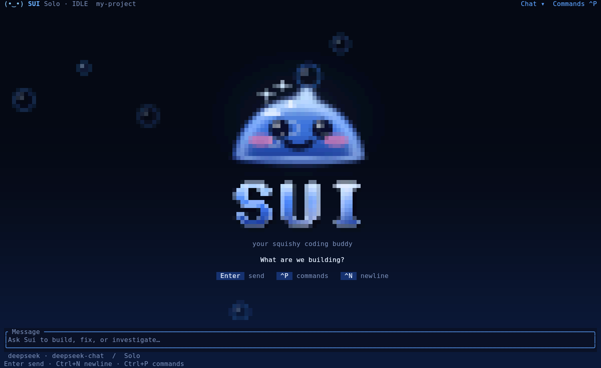
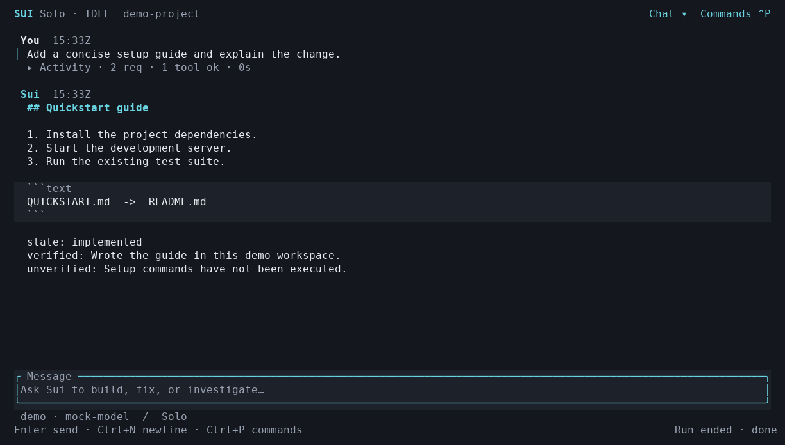

# sui

Cache-first multi-agent coding harness. A strong model decomposes and
audits; cheap workers implement in isolated git worktrees; deterministic
gates decide what ships. Ships with a mouse-enabled terminal UI —
configure providers, run tasks, and watch every step from one screen.

```bash
sui                 # the TUI — everything happens here
sui --mission       # TUI in mission mode (orchestrator → workers → auditor)
sui --yolo          # auto-approve everything (same flag as the `a` key)
sui "fix the bug"   # headless one-shot — no UI
```

## Install

Pick **one** — Homebrew (recommended, macOS + Linux) or the shell
installer. Don't stack both: they install the same binaries to different
prefixes, and whichever comes first on PATH wins.

### Homebrew (macOS and Linux)

```bash
brew install fordft/tap/sui-ai
sui
```

The `sui-ai` formula installs prebuilt binaries (`sui`, `sui-mission`,
`sui-certify`) — no Rust or compilation needed. Update with
`brew upgrade sui-ai`; remove with `brew uninstall sui-ai` (your config,
credentials, and journals are never touched).

### Shell installer (no Homebrew)

```bash
curl --proto '=https' --tlsv1.2 -LsSf \
  https://github.com/fordft/sui/releases/latest/download/sui-installer.sh | sh
```

Checksum-verified alternative (recommended — also checks for a foreign
`sui` on your PATH):

```bash
curl --proto '=https' --tlsv1.2 -LsSf \
  https://github.com/fordft/sui/releases/latest/download/install.sh | sh
```

Installs to `~/.sui/bin` (user-owned, no sudo). If `~/.sui/bin` isn't on
your PATH yet, launch with the absolute path: `~/.sui/bin/sui`.

**Prefer to inspect first?**

```bash
curl -LsSf -o sui-installer.sh \
  https://github.com/fordft/sui/releases/latest/download/sui-installer.sh
less sui-installer.sh
sh sui-installer.sh
```

**Name-collision note** — the Mysten blockchain toolchain also ships a
`sui` command. The shell installer always targets `~/.sui/bin` and never
touches another installation; `install.sh` additionally warns when a
different `sui` already owns the name on PATH.

**Rollback** — pin a release:

```bash
SUI_TAG=v0.4.2 sh -c "$(curl -LsSf \
  https://github.com/fordft/sui/releases/download/v0.4.2/install.sh)"
```

## Model planes

Sui speaks to models three ways. Pick per role — solo, orchestrator,
worker, auditor can each use a different one.

### OpenAI-compatible API profiles

DeepSeek, OpenRouter, a local proxy — anything that serves
`/v1/chat/completions`. Configure in the TUI setup screen or
`~/.config/sui/config.toml`:

```toml
[profiles.cheap]
base_url = "https://api.deepseek.com/v1"
model = "deepseek-chat"
key_env = "DEEPSEEK_API_KEY"
pricing = { input = 0.28, cached = 0.028, output = 0.42 }   # $/MTok
```

Credentials entered in-app are masked and stored per your choice: OS
keyring, plaintext config, session-only, or env var. On headless machines
with no keyring, the config-file store is the default.

### ChatGPT sign-in (codex-oauth)

Already ran `codex login`? That's all you need — Sui detects
`~/.codex/auth.json` and auto-registers a `codex` profile (model follows
your Codex CLI config). Pick it in Settings → any role, or pass
`--control-profile codex` / `--worker-profile codex` to sui-mission. No
API key, no TOML.

To customize, an explicit profile wins over the auto-registered one —
or use Settings → "+ add provider" → "ChatGPT (Codex OAuth)":

```toml
[profiles.codex]
kind = "codex-oauth"
model = "gpt-5.5"
```

No Codex CLI login? Sign in directly: `sui auth` (browser flow;
`--manual` pastes the callback URL for headless/SSH). This calls the
Codex backend's Responses API — subscription access, not API billing,
so cost fields report unknown rather than zero. Tokens refresh
transparently and never touch journals or prompts.

All roles run Sui's native agent loop with a model/provider profile.
The Codex OAuth profile uses the Responses API through this same loop.

ACP executable-agent support has been removed. Remove legacy [agents]
tables and replace acp:<name> values in [ui] roles with native profile
names. Missions use --control-profile, --worker-profile and optional
--auditor-profile. The old --*-agent flags and acp-bridge command are
unavailable. Configuration is never rewritten automatically; historical
journals remain available through export.

## The TUI

First run opens setup — add a profile, pick models per role, type a
task. The main screen puts the conversation first, with a growing multiline
composer and compact header. Completed activity folds to one line
(`3 reqs · 7 tools · 12s`); final answers and failed-step excerpts stay
visible. Headings, fenced code, and quotes get distinct styles; their
original text remains available for selection and details. Expand activity
for bounded previews or open its details. A running timer and explicit
approval state show what is happening; a finished run displays its runtime
outcome without implying verification.



*Rendered from the TUI's own frame buffer at 150×46 with the animation clock
pinned — in a terminal the slime hops, blinks, and follows your typing.*



*Terminal capture using a local mock provider.* More views:
[empty screen](docs/images/sui-tui-empty.png),
[command palette](docs/images/sui-tui-commands.png),
[permission prompt](docs/images/sui-tui-permission.png),
[terminal-native colors on a light background](docs/images/sui-tui-terminal.png).

**Commands and views:** `Ctrl+P` or the clickable header opens a searchable
palette. Type to filter, use `↑↓` and Enter to choose, or Esc to return to
your draft. The palette sizes to its results and keeps the selected row
visible. Chat, Tasks, Changes, Usage, and Settings remain available;
`Ctrl+T` cycles views and Esc returns to Chat. Existing `/solo`, `/mission`,
`/export`, and `/help` commands still work.

Tasks, Changes, and Usage scroll independently with the wheel, arrow keys,
Page Up/Down, and Home/End. Their position indicators show when more content
is available. Usage keeps each agent/model pair separate: `—` means a
measurement is missing, `0` means a reported zero, and `+ (partial)` marks
totals with missing measurements.

Usage also shows a **token-weighted cache percentage**, with measured-request
coverage. Only complete, non-estimated input/cache pairs with cached ≤ input
enter the percentage; failed or missing-usage requests remain in its coverage
denominator. First requests in each observed session/epoch and subsequent
requests have separate rates. The latest epoch, request purpose and first-delta
latency are shown when recorded. Observed model/prefix/tool/guidance/cache-key
changes are local diagnostics; provider TTL/routing causes remain unknown.

**Appearance:** Settings → theme switches between `slime` (default: black and
deep blue with an azure gel slime), `dark`, and `terminal` (your terminal's
foreground, background, and ANSI colors). The preference persists as
`[ui].theme`. No special font is required; `NO_COLOR` is respected. Solo
starts with the sidebar hidden; Mission shows agents and run status at widths
of 110 columns or more. `Ctrl+B` toggles it; Tasks remains accessible on
narrow screens.

**The slime and motion:** the home screen is a small animated world. A
pixel-art slime blinks, hops, follows your typing with its eyes, naps when
you leave it alone, and squishes when you click it; a short splash plays at
launch (any key skips it). While a task runs, the composer border flows,
status text shimmers, and a companion slime keeps you company under short
transcripts; a successful run ends with a burst of bubbles. Empty Tasks,
Changes, and Usage views get a napping slime. Everything here is
presentation: it never reaches model requests, journals, or exports.

- Pixel art needs a truecolor terminal (`COLORTERM=truecolor`). With
  `NO_COLOR`, the `terminal` theme, or a terminal that announces less, Sui
  draws a text slime instead.
- Settings → motion (or *Cycle motion* in the palette) chooses `full`,
  `calm` (~8 fps, no splash, bubbles, or confetti — the default over SSH),
  or `off` (frames are static). It persists as `[ui].motion`; `SUI_MOTION`
  overrides it for one launch.

**Input and keys:** Enter sends · `Ctrl+N` inserts a newline · `↑` recalls
history from an empty composer · Tab focuses activity · `v` opens selected
step details · `Ctrl+R` cycles reasoning · `Ctrl+O` switches Solo/Mission ·
`Ctrl+S` stops · `Ctrl+Q` quits · F1 opens help. The composer grows to six
text rows, then scrolls to keep the cursor visible. Editing respects
Unicode grapheme boundaries. Editing a recalled task makes it your draft;
history navigation no longer replaces that edited text. A draft entered
during a run is kept until you send it after the run finishes. Mode changes
are available after the current run stops.
Ctrl+B, Ctrl+O, Ctrl+R, and F1 also work while activity has keyboard focus.
Changing reasoning visibility keeps the selected activity when it remains visible.

**Mouse** (also over SSH): wheel scrolls, click expands activity or opens
commands, drag selects and auto-copies via OSC52. `Shift+drag` uses native
terminal selection. Toggle capture in Settings → mouse.

Mutating tool calls ask first: `y` approves once, `a` approves for the
session (`AUTO` in the header), `n`/Esc denies. Enter never approves.
Permission previews scroll with `↑↓`, PageUp/PageDown, or the wheel;
decision buttons remain fixed and clickable. `Ctrl+S` and `Ctrl+Q` work
inside prompts. An ask arriving while you type in a dialog is queued;
closing the dialog surfaces it without treating typed text as approval.

## Web research

Native agents get two first-class tools — `web_search` and `web_fetch` —
backed by [Exa's hosted MCP service](https://exa.ai/mcp). Off by default;
enable in **Settings → web research** (`off`/`ask`/`auto`) or
`[web] access = "ask"` in global config. Anonymous access works but is
rate-limited; an optional Exa API key (Settings → exa api key, or
`SUI_EXA_API_KEY`) raises usage.

Search results come back as source IDs (`[S1]`, title, URL, snippet) —
snippets are labeled snippets, not fetched pages. `web_fetch(url)` reads
one source as bounded Markdown; cached hits are labeled with their age.
The policy is independent of tool auto-approve: **YOLO never turns web
access on**, and queries/requested URLs leave the machine. Unsafe
targets — private/link-local/metadata IPs, credential-bearing or
secret-shaped URLs, non-http(s) schemes — are refused before anything is
sent. Per-run request caps apply across all workers in a mission.

## Built-in headless UI testing

Ask Sui to test a web or terminal interface directly. Native agents have
`browser`, `terminal`, and `view_image` tools; Sui opens and owns the
sessions. No monitor, desktop, Xvfb, separate Playwright CLI, or ttyd
server is required, including on Ubuntu over SSH.

- `browser`: open a URL, inspect an accessibility snapshot, click/fill by
  role and exact name or CSS selector, press keys, resize, screenshot, close.
- `terminal`: start a real program with arguments in the workspace,
  type/press keys, resize, inspect the interpreted terminal screen,
  screenshot, close. ANSI cursor movement and alternate screens are rendered
  with xterm, rather than treated as a raw output log.
- `view_image`: send a workspace PNG/JPEG/WebP (up to 4 MiB) as image input.

On first use, independent UI consent covers downloading **pinned**
Playwright/xterm packages and Chromium into the user cache. Later sessions
reuse the cache. The server needs **Node.js 20+, npm, and Chromium system
libraries**; Sui does not install privileged OS packages. No project
dependencies are modified. Session processes are killed on cancellation,
timeout, close, or agent drop. Each native agent owns its own sessions.

Browser requests and WebSockets are restricted to HTTP(S)/WS(S) on
`localhost`, `127.0.0.1`, and `[::1]`, including redirect destinations.
Service workers and downloads are disabled. To authorize unattended UI
sessions, set `[browser] approved = true` in **global user config**;
`allow_remote = true` separately permits remote traffic, and
`auto_install = false` prevents automatic dependency downloads. Project
config, YOLO, and web-research settings cannot enable these permissions.
This is an automation guard, not an OS sandbox; terminal programs run
with user privileges and a scrubbed environment, like the bash tool.

Image-capable API profiles must declare `image_input = true` in trusted
`[provider]` or `[profiles.<name>]` config. Codex OAuth defaults to image
input. Text-only profiles still use snapshots and can save screenshots,
but receive an explicit **visual review unverified** result. Images stay
in memory unless the tool requests a workspace-relative `path`; image
bytes are never placed in journals or exports. Browser screenshots mask
password fields and elements marked `data-sui-private`; snapshots exclude
these fields too, and fill refuses private/password targets. Use test data.
Screenshots are viewport captures. Check persisted application state as
well as appearance before declaring a flow verified.

The real browser/PTY integration test is opt-in because it can download
dependencies:

```bash
cargo test --test ui_headless -- --include-ignored
```

## Code inventory

Native agents can call `inventory` directly in Solo or any Mission role;
there is no server, index command or configuration to start separately.
`files` lists workspace-relative paths. `symbols` locates named functions,
methods, types and other declarations using Tree-sitter, with file and
1-based start/end lines for the next `read_file` call. For example:

```json
{"action":"symbols","query":"checkout","path":"src","limit":20}
```

Queries are literal, case-insensitive substrings of names or paths.
Symbol extraction supports Rust, JavaScript/JSX, TypeScript/TSX, Python
and Go. Other languages remain discoverable through `files` and shell
search. Common forms include trait signatures, type aliases and direct
function/class bindings, including parentheses and TypeScript assertions.
Names are retained in full when they fit the output budget. This is a
syntax inventory; it does not resolve references, dynamic dispatch,
macro expansion or a semantic call graph.

Each call scans current files, including uncommitted edits and new files,
inside that agent's workspace/worktree. Ignore rules are loaded only from
bounded, regular, non-symlink files within that workspace: `.ignore` takes
precedence over `.gitignore`, then in-workspace `.git/info/exclude`.
Each control file is limited to 64 KiB and each rule line to 4 KiB.
Unsafe, oversized, unreadable, non-UTF-8, NUL-containing or malformed rules
prune the affected subtree and mark the scan partial with an ignore warning.
Global excludes and outside-workspace Git metadata are not read;
a worktree's `.git` pointer is not followed, while its workspace ignore
files still apply.

Symlinks, dependency/metadata directories and known credential-file names
are always excluded. Root `target`, `build`, `dist` and `coverage`
directories are skipped by default; an explicit `path` bypasses this default
exclusion while still respecting workspace ignore rules and safety checks.
Source directories such as `src/build` and `src/target` remain visible.
No files are written, and no local parse cache or index is maintained.
Results stay in appended tool history; no changing repo map is inserted
into the stable prompt.

Scans have a three-second cooperative budget, a 10,000-entry enumeration
budget before filtering, 32 MiB of source/ignore input and 500,000-node
limits. `bytes_read` includes rejected input; source files over 512 KiB
are skipped using metadata before reading. Cancel waits for the worker
to observe cancellation and finish; these limits do not impose a hard
timeout on stalled remote filesystems. Output defaults to 50 rows (max
200) with a 24 KiB row budget. Skipped files, syntax errors, unsupported
files and truncation are reported; partial results never prove a symbol
is absent. Narrow `path` or `query` when needed.

Adding this tool changes the native tool/system signature. Sessions from
v0.5.0 and earlier remain inspectable/exportable, but Resume requires the
same recorded signature and therefore a matching older binary. Start a
new session to use inventory.

## Code context

Native agents can call `code_context` in Solo and Mission roles to collect
bounded source regions in one tool result. It runs inside Sui on headless
servers, using the embedded parsers; there is no separate command, language
server, model call or network service to start.

```json
{"action":"search","query":"cache usage tokens","path":".","limit":5,"max_bytes":12000}
```

Search uses concrete terms from the task: identifiers, paths and source
text. Whitespace-separated terms match case-insensitively; more covered
terms and name/path matches rank higher. Results are lexical candidates,
with one selected region per file (default five files, maximum twenty),
including eligible tests, documentation and configuration. They contain
numbered source excerpts,
selection reasons and source hashes. Matching names or text does not prove
that two symbols refer to each other or that every relevant file was found.
For a task in another language, the agent can supply identifiers or terms
used in the codebase.

```json
{"action":"read","path":"src/tui/usage.rs","line":50,"max_bytes":12000}
```

Read selects the enclosing syntax definition around a known 1-based line,
with nearby documentation, attributes, enclosing type headers and bounded
imports where recognized. Plain text and unsupported syntax use a line
window. Follow the output's source locations to expand with another
`code_context` read or `read_file`; use `code_intel` separately when Rust
semantic definitions or references are needed.

The complete tool result is bounded by `max_bytes` (default 12,000, range
1,024–24,000). This is a byte budget; actual provider tokens still come from
provider usage. Omitted regions and incomplete scans are explicit. Source is
observed from current files and hashed, rather than summarized by a second
model. Hashes identify the bytes read; they do not establish an atomic
repository snapshot or prove that the task has enough context.
`omitted` counts matching files that were not returned;
`omitted_source_lines` counts gaps within returned excerpts. Scan coverage,
parser coverage and excerpt completeness are reported separately.

The tool shares inventory's bounded traversal, ignore policy, credential
exclusions and regular-file checks. Files containing recognized credential
formats or credential-like literal assignments are withheld before hashing,
parsing, caching or returning source. Incomplete credential literals are
also withheld. This is a heuristic: unusual or
dynamically assembled secrets can evade it, and realistic example tokens
can cause a file to be withheld. Accepted excerpts remain exact source.
A per-agent in-memory cache reuses
syntax facts only after checking freshly read source content. Ignore rules
are rechecked on each call; worktrees do not share the cache. Local parse
cache counters are separate from provider prompt-cache usage. Every call
returns actual excerpts, including cache hits and calls after compaction.
Results append to tool history; the stable prompt is not rewritten.
The shared scan budgets are three cooperative seconds, 10,000 entries,
32 MiB of source/ignore input, 512 KiB per source and 500,000 syntax nodes.
The cache holds at most 128 entries and 2 MiB of accounted syntax/key data;
this is not a process-memory limit. Cancellation joins the worker, while
stalled filesystem calls must return before cooperative cleanup can finish.

Adding `code_context` changes the native tool/system signature. Start a new
session after updating Sui; older sessions remain inspectable/exportable,
and Resume requires their recorded signature.

## Rust code intelligence

Native agents can call `code_intel` for Rust definitions, references and
file diagnostics in Solo or Mission worktrees. Sui starts and owns a
language-server process on demand, over stdio. It works on headless servers
without an editor, display, separate server command or external agent harness.
The installed Rust toolchain must include the `rust-analyzer` and `rust-src`
components; Sui does not download or install them at runtime. No additional
Sui configuration is needed.

```json
{"action":"definition","path":"src/lib.rs","line":12,"column":9}
{"action":"references","path":"src/lib.rs","line":12,"column":9,"limit":20}
{"action":"diagnostics","path":"src/lib.rs"}
```

`line` and `column` are 1-based. Columns count Unicode scalar characters,
rather than bytes or LSP UTF-16 units; returned locations use the same
convention. Definition and reference queries require both coordinates.
Results stay within the agent's workspace, exclude unsafe paths and symlinks,
and report omitted locations. Read the relevant region before editing.

This tool uses the normal **local execution approval**, like `bash`;
session approval and Auto/YOLO apply. Build scripts, procedural macros and
check-on-save are disabled, and Cargo metadata runs with `--offline` and
`--locked`. `rust-analyzer.toml` in the inspected workspace tree, including
nested files, is unsupported because it can override server policy.
Before each call, a presence-only scan ignores Git ignore rules, examines
at most 10,000 entries and 128 directory levels, and uses a cooperative
three-second budget. It skips inventory's mandatory metadata, dependency
and credential exclusions plus root `target`, `build`, `dist` and `coverage`
directories. Visible symlinks, inaccessible paths or exhausted scan limits
make configuration coverage unknown and close the session. This check is
scoped to that tree and runs between calls; local Rust/Cargo tooling still
runs with user privileges, and these settings are not an OS sandbox.

Each agent's workspace owns its own lazy session. Sui invalidates it before
file edits, shell commands and terminal actions that may change files;
the next query starts a fresh session. Results report `project_mode: cargo`
when the workspace root contains a regular `Cargo.toml`. Otherwise,
`project_mode: detached` analyzes one standalone file at a time, and
switching files reinitializes the language server. Standalone results are
always partial because coverage across files is unknown. Nested Cargo
projects are not discovered from the repository root; start Sui in their
Cargo root, or include them in the root Cargo workspace.

Initialization/readiness has a 60-second deadline and each query a
30-second deadline. Transient `ContentModified` or retriggerable
`ServerCancelled` responses receive at most three additional attempts,
25 milliseconds apart, within that query deadline. These retries stay
inside the same tool call and add no model/provider request. Cancellation,
timeouts and protocol failures close the session, kill its process group
and attempt to reap it within three seconds. An unavailable server or
unsupported operation produces an explicit error; Sui does not substitute
syntax matches for semantic results. Stopping an agent also closes its idle
language backend; successful turns can reuse the workspace session.

Source files read for queries and returned positions are limited to 512 KiB
each and 32 MiB total per call. Output defaults to 50 rows, with a maximum
of 200 and a 24 KiB row budget; these limits do not cap the server's internal
workspace indexing. Result processing examines at most 4,096 records under
a cooperative three-second budget; remaining records count as omitted.
Cancellation waits for the processing worker to stop and closes the backend.
Filesystem calls must return before cooperative cleanup can finish. Invalid
semantic responses produce an error and reset the backend.

Check `file_in_project` (`true`, `false` or `unknown`), `analysis_health`,
`analysis_complete` and `results_omitted`. Complete analysis requires a
healthy Cargo backend, confirmed membership of the queried file and no
omitted results. Unlinked files and unknown membership remain partial.
Loading or missing dependencies can also make observations partial.
Empty results do not prove absence.
Diagnostics are native analyzer observations, not `cargo check` or test
acceptance proof.

The schema is appended after inventory and remains frozen for each run.
Adding code intelligence changes the tool/system signature: older sessions
remain inspectable/exportable, but Resume rejects a mismatched signature.
Start a new session to use the new tool.

## Engineering lenses

Native agents carry a small always-on **scan** (outcome · correctness ·
interaction · failure/recovery · security · performance · compatibility ·
maintainability · verification — including concerns the user didn't
name) plus a compact index of engineering guides. At task start, Sui
selects up to three relevant lenses from task cues + project facts
(detected manifests/deps) and injects them into the run — labeled
*runtime guidance, not user requirements*. The `skill` tool loads any
other lens on demand. Guides inform judgment; they never add
requirements, permissions, or scope. Bundled lenses: product-exploration,
debugging (+ async/subprocess references), code-review (+ rust/python/
typescript references), tui-quality, first-run-experience,
release-verification.

## Missions

`sui --mission` or `sui-mission` headless:

```bash
sui-mission --control-profile strong --worker-profile cheap \
  --auditor-profile strong --task "..." 
```

The runtime — not the model — owns scheduling, worktrees, contract
validation, ownership checks, acceptance commands, integration, and
bounded repair/escalation. Your original checkout is never modified;
accepted work lands on a `sui-mission-*` branch.

## Resume a native session

Open **Ctrl+P → Recent sessions / Resume**, or type `/resume`, then choose a
recorded session for the current workspace. The searchable list shows up to 30
recent native sessions. Your draft stays in the composer. The conversation,
recorded tool results and Usage return without running any old tool calls.
Saved checks are historical evidence and need rechecking against current code.

Headless/SSH entry points use the same recovery path:

```bash
sui --resume latest "continue the task"
sui --resume <run-id>                  # opens the TUI on a terminal
```

Recovery creates a fresh private run with a copy of the journal and verified
opaque replay sidecars; the source journal stays unchanged. It retains the
native session identity, request sequence and context epoch. Current permission
settings apply; approvals recorded in the old journal never grant permission.
Cache reuse still depends on the provider, its retention and routing.

The recorded profile/model, wire adapter, tool schemas, system contract and
project guidance must still match. An active session, unfinished turn or tool
call, damaged journal, missing/tampered sidecar, or memory-only image observation
is refused explicitly. Recovery is bounded to 32 MiB of journal and 64 MiB of
replay state. Missions use their own lifecycle and cannot be resumed this way.
Sessions recorded before resume headers were introduced remain exportable;
they cannot promise the same request header and are marked unavailable.

## Export a run report

Every run journals to `~/.local/share/sui/runs/<run-id>/` — requests,
messages, tool calls with exit codes, mission gates, audit verdicts:

```bash
sui export --latest              # newest run for the current workspace
sui export --run <run-id>        # a specific run
sui export --run <id> --format json
sui export --run <id> --include-diff   # bounded git diff of accepted work
```

In the TUI: **Settings → export run report**, or `/export` in the input —
works during a run (labeled partial). Reports land at
`~/.local/share/sui/exports/<run-id>/report.md` (mode `0600`), built from
journals with credentials redacted best-effort; missing data shows
"Not recorded"/"Unknown", never invented. **Review before sharing** —
reports contain project code. No API calls needed.

## Config files

- **Global** `~/.config/sui/config.toml` — providers, profiles, trusted
  agents, UI settings. The only place credentials live.
- **Project** `sui.toml` — workspace prefs only. API keys and `[agents]`
  here are *ignored*; a project file that redirects `base_url` to an
  untrusted endpoint is gated interactively and hard-fails headless.
- **State** `~/.local/share/sui/` — journals, run reports, history.

See `sui.example.toml` for the full annotated schema.

If a provider rejects a model name containing picker details such as
`ctx=272000`, `tools`, or `$2.00/$8.00per-M`, check the profile's `model`
in the global config. Earlier builds could save the entire display label.
Replace it with the exact model ID from that provider's catalog, then
restart Sui. Context size, tool support, and pricing are display metadata;
they are never part of the selected model ID. A corrected ID still needs
to be available to your provider account.

## Update / uninstall

**Update**: `brew upgrade sui-ai` or rerun the installer — config,
credentials, and journals are preserved; only `~/.sui/bin/*` is replaced.

**Uninstall**: remove `~/.sui/bin`. Delete `~/.config/sui` and
`~/.local/share/sui` only if you want the state gone.

## Platforms & runtime requirements

Prebuilt binaries: macOS (Apple Silicon, Intel), Linux x86-64 and ARM64 —
GNU builds link against **glibc 2.35** (Ubuntu 22.04 baseline); older
distros and Alpine/musl are not covered. Native Windows is not packaged
(WSL2 works).

Runtime: **git** and **bash** for workspace/mission operations; the
target project's own toolchain for its builds/tests. Headless Linux is
supported — without a desktop credential service, keys fall back to
session/env storage, and `sui auth codex --manual` handles login.

## Cache behavior and long sessions

Profiles default to Chat Completions. Set `kind = "openai-responses"` in a
trusted global profile to use a compatible `/v1/responses` endpoint directly.
This keeps Responses usage fields (including reported zero cache reads and
writes) and encrypted reasoning for tool continuation. It also avoids token
count changes introduced by some gateways' Chat conversion paths. Sui never
subtracts a guessed gateway overhead. `sui-certify` reports a token-weighted
cache rate with measured-request coverage; missing fields remain unknown.
Pricing uses separate uncached, cache-read, and cache-write input buckets.
An incomplete count or required price makes the estimate unknown.

With `[agent] context_compaction = true` (default), the native loop requests a
summary near 80% of its context budget. The request appends a summary instruction
while preserving model, tool schemas, settings and the existing conversation.
A completed bounded summary becomes a journaled context checkpoint in a new
epoch, retaining the latest text task verbatim. Summary generation counts toward
request limits and usage. Tool calls from a summarization request are never
executed. Failed or insufficient summaries preserve the old history; input
already above the hard budget still stops. A summary provides context, not
runtime verification or permission. Set `context_compaction = false` to retain
the original stop-at-budget behavior.

Opaque reasoning for journal replay lives in bounded, owner-only, hash-verified
`replay-*.json` sidecars next to the journal. Sidecar contents are excluded from
exports. Keep them with the journal for exact Responses replay; a missing or
modified sidecar fails replay explicitly. Image-bearing history still cannot
claim exact replay from text-only journals. Gateway/backend caching controls
require separate capability verification; an API-compatible endpoint need not
support explicit breakpoints or public API diagnostics.

## Known limitations

- Changes tab shows status + `diff --stat`, not full diffs.
- Per-worker transcript panes are not implemented; journals under
  `~/.local/share/sui/runs` hold the full record.
- Provider/model behavior is `UNVERIFIED` until `sui-certify` runs
  against real credentials — installation proves nothing about a
  provider's tool-calling or cache behavior.
- Comparison clones isolate *repositories*, not the filesystem — a
  misbehaving agent could inspect siblings.
- codex-oauth rides your ChatGPT subscription — requests count against
  your Codex rate windows, and reuse of `~/.codex/auth.json` assumes the
  file-based store (keyring-stored credentials aren't readable).
